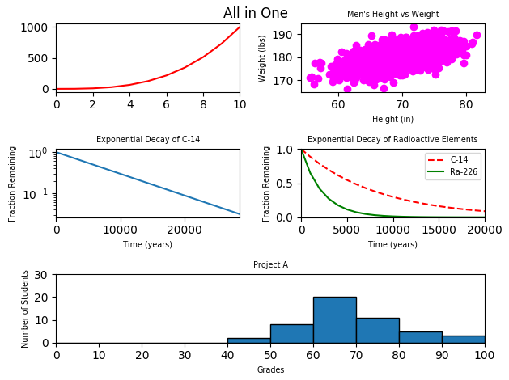
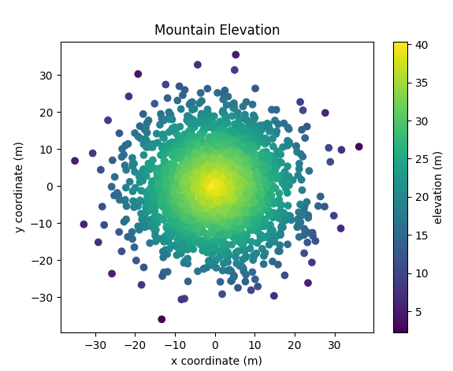
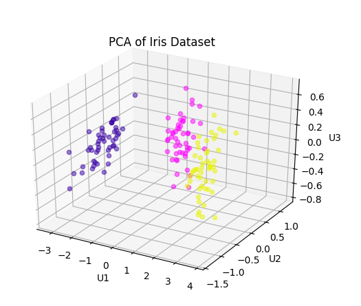

# Plotting

Project done during **Software Engineering studies** at **Holberton School**. It aims to learn about plot, scatter plot, line graph, bar graph, histogram and `matplotlib`.

## Technologies
* Python Scripts are written with Python 3.5
* `Matplotlib`, version 3.0

## Files
All of the following files are scripts and programs written in Python:

| Filename | Description |
| -------- | ----------- |
| `0-line.py` | Script to plot an array |
| `1-scatter.py` | Shows a scatter plot |
| `2-change_scale.py` | Shows a line graph logarithmically scaled |
| `3-two.py` | Shows a plot with two labeled line graphs |
| `4-frequency.py` | Shows a histogram binded by 10 units |
| `5-all_in_one.py` | Shows 5 subplots in one figure |
| `6-bars.py` | Shows a stacked bar graph |
| `100-gradient.py` | Shows a scatter plot with a colorbar |
| `101-pca.py` | Shows the scatter plot of Iris Dataset through Principle Component Analysis (PCA) |

## Examples

* Multiple plots in one figure

* Gradient

* Scratter Plot of Iris Dataset

