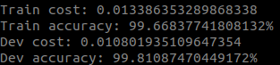
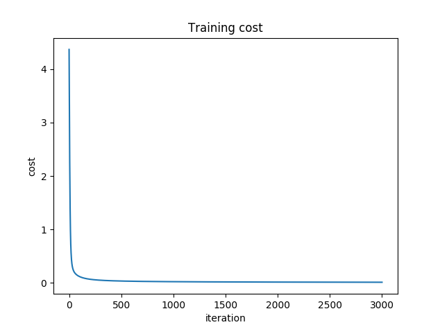
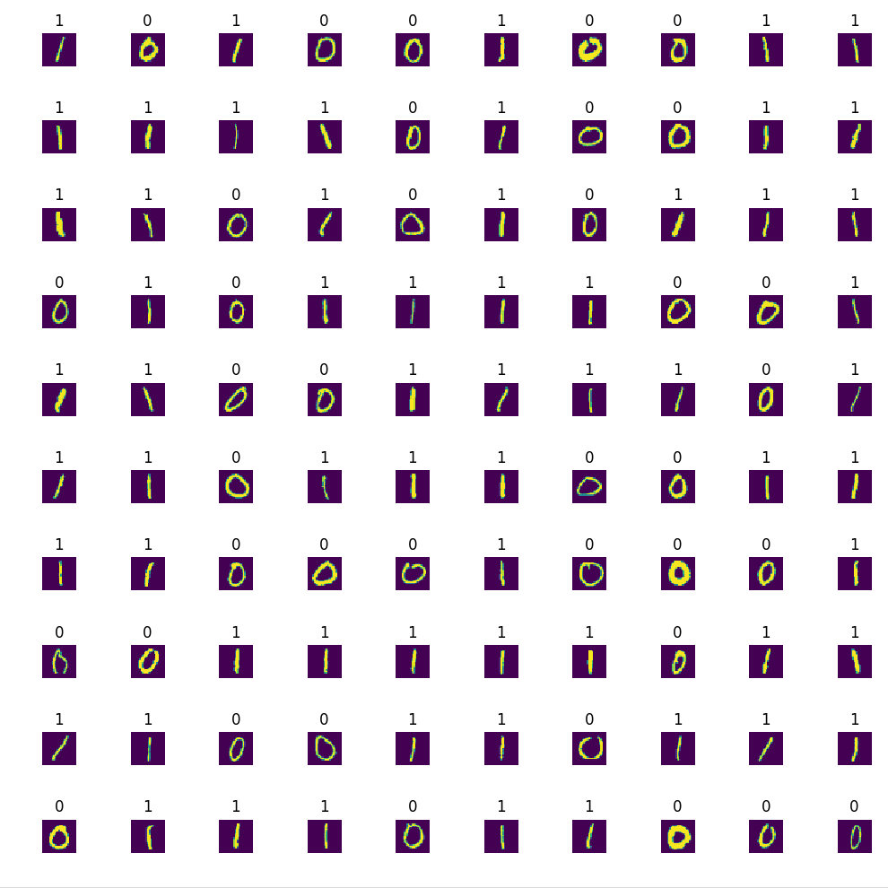
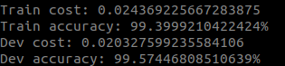
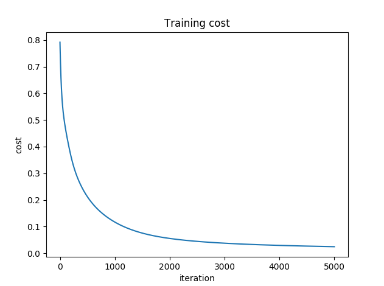
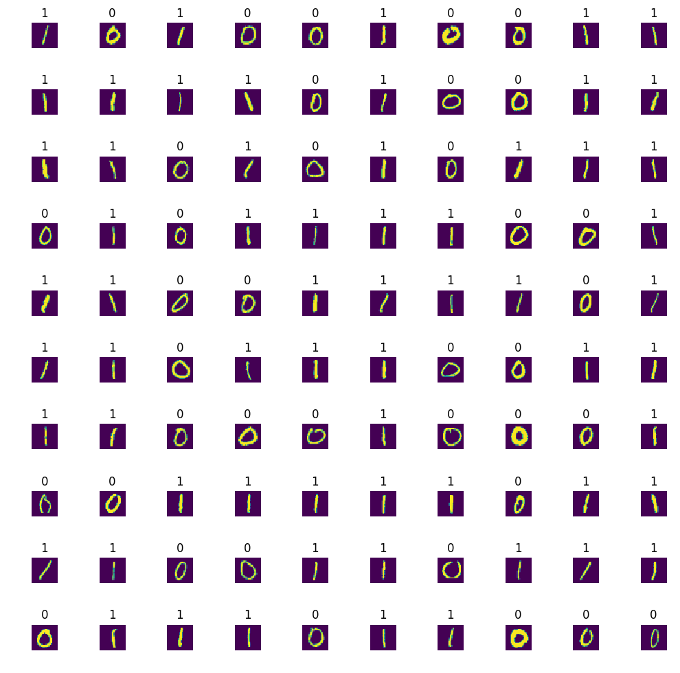
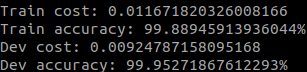
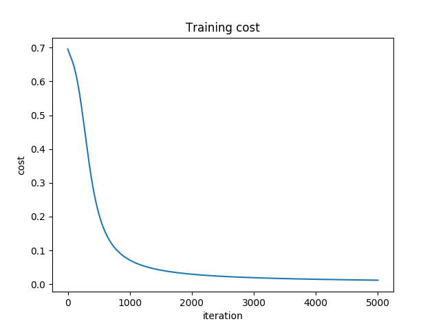
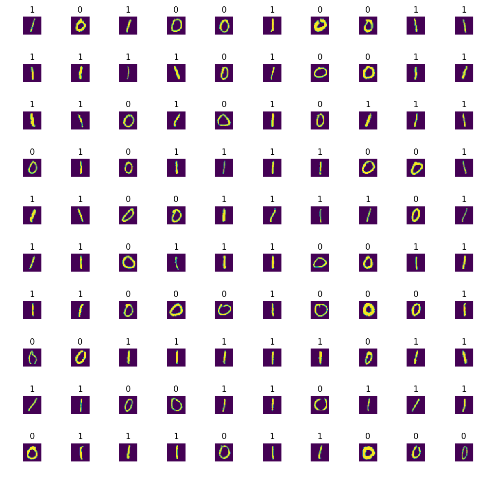

# Binary Classification

Project done during **Software Engineering studies** at **Holberton School**. It aims to learn about models, supervised learning, prediction, nodes, weight, bias, activation functions, layers, logistic regression, loss and cost functions.

## Technologies
* Python Scripts are written with Python 3.5
* `NumPy`, version 1.15
* `Matplotlib`, version 3.0

## Files
All of the following files are scripts and programs written in Python:

| Filename | Description |
| -------- | ----------- |
| `0-neuron.py` | Class `Neuron` that defines a single neuron performing binary classification |
| `1-neuron.py` | Class `Neuron` with private instance attributes (W, b, A) |
| `2-neuron.py` | Class `Neuron` with `forward_prop` method to calculate the forward propagation of the neuron |
| `3-neuron.py` | Class `Neuron` with `cost` method to calculate the cost of the model using logistic regression |
| `4-neuron.py` | Class `Neuron` with `evaluate` method which returns the neuron's predictions |
| `5-neuron.py` | Class `Neuron` with `gradient_descent` method to calculate one pass of gradient descent on the neuron |
| `6-neuron.py` | Class `Neuron` with `train` method to train a neuron with logistic regression |
| `7-neuron.py` | Class `Neuron` with `train` method to train a neuron and graphs its training cost |
| `8-neural_network.py` | Class `NeuralNetwork` that defines a neural network with one hidden layer performing binary classification |
| `9-neural_network.py` | Class `NeuralNetwork` that defines a neural network based on `8-neural_network.py` file, with private instance attributes |
| `10-neural_network.py` | Class `NeuralNetwork` with `forward_prop` method |
| `11-neural_network.py` | Class `NeuralNetwork` with method to calculate the cost of the model using logistic regression |
| `12-neural_network.py` | Class `NeuralNetwork` with `evaluate` method which returns the neural network's predictions |
| `13-neural_network.py` | Class `NeuralNetwork` with `gradient_descent` method to calculate one pass of gradient descent on the neural network |
| `14-neural_network.py` | Class `NeuralNetwork` with `train` method |
| `15-neural_network.py` | Class `NeuralNetowrk` with `train` method to train a neural network and graphs its training cost |
| `16-deep_neural_network.py` | Class `DeepNeuralNetwork` that defines a deep neural network performing binary classification |
| `17-deep_neural_network.py` | Class `DeepNeuralNetwork` with L, cache and weights as private attributes |
| `18-deep_neural_network.py` | Class `DeepNeuralNetwork` with `forward_prop` method |
| `19-deep_neural_network.py` | Class `DeepNeuralNetwork` with method to calculate the cost of the model using logistic regression |
| `20-deep_neural_network.py` | Class `DeepNeuralNetwork` with `evaluate` method which returns the neural network's predictions |
| `21-deep_neural_network.py` | Class `DeepNeuralNetwork` with `gradient_descent` method to calculate one pass of gradient descent on the neural network |
| `22-deep_neural_network.py` | Class `DeepNeuralNetwork` with `train` method |
| `23-deep_neural_network.py` | Class `DeepNeuralNetwork` with `train` method to train a deep neural network and graphs its training cost |

## Review

**TRAINING A NEURON**

Stats:

Cost:

Response:

**TRAINING A NEURAL NETWORK**

Stats:

Cost:

Response:

**TRAINING A DEEP NEURAL NETWORK**

Stats:

Cost:

Response:

